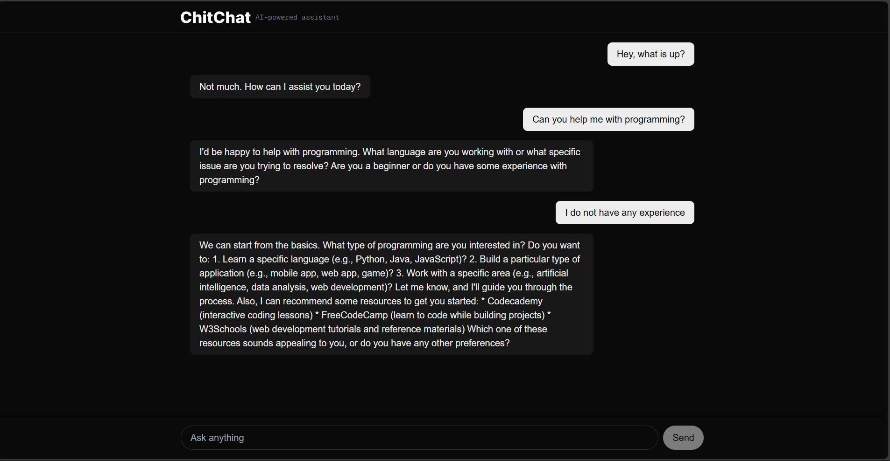

# ChitChat App 💬

</br>

[](https://nextjs.org/)
[](https://sdk.vercel.ai/)
[](LICENSE)

<div align="center">
  
  <p>A simple chatbot built with Next.js and Vercel AI SDK</p>
</div>

## 🚀 Overview

ChitChat is my exploration project into the Vercel AI SDK, featuring:
- Real-time conversational AI
- Clean, modern interface
- Easy integration with popular LLMs

## ✨ Features

- 💬 Natural language conversations
- 🌓 Light/dark mode support
- ⚡ Fast responses with streaming

## 🧩 Tech Stack
- Next.js
- TypeScript
- Tailwind CSS
- Vercel AI SDK


### Installation
1. Clone the repository:
   ```bash
   git clone https://github.com/Augusto-Chissano/chit-chat-app.git

## 🛠️ Getting Started

### Prerequisites
- Node.js 18+
- npm/yarn/pnpm/bun
- PROVIDER_API_KEY


## Getting Started

First, run the development server:

```bash
npm run dev
# or
yarn dev
# or
pnpm dev
# or
bun dev
```

Open [http://localhost:3000](http://localhost:3000) with your browser to see the result.


Your feedback and contributions are welcome!
